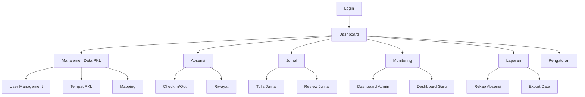

# Dokumen Persyaratan Produk - Sistem Absensi dan Jurnal PKL

## 1. Product Overview

Sistem manajemen absensi dan jurnal untuk siswa Praktik Kerja Lapangan (PKL) yang memungkinkan monitoring kehadiran dan aktivitas siswa secara digital.
Sistem ini dirancang untuk memfasilitasi admin sekolah, guru pembimbing, dan siswa dalam mengelola seluruh aspek PKL mulai dari pendaftaran hingga pelaporan.
Target sistem adalah meningkatkan efisiensi monitoring PKL dan memberikan transparansi data kehadiran serta aktivitas siswa.

## 2. Core Features

### 2.1 User Roles

| Role  | Registration Method    | Core Permissions                                                                                                                                                                           |
| ----- | ---------------------- | ------------------------------------------------------------------------------------------------------------------------------------------------------------------------------------------ |
| Admin | Direct system access   | Mengelola seluruh data PKL, import/export data, mengelola tempat PKL (tambah/edit/hapus), mengatur waktu absensi (jam masuk/pulang), mapping siswa-guru-tempat PKL, monitoring keseluruhan |
| Guru  | Ditambahkan oleh admin | Monitoring siswa bimbingan, memberikan komentar jurnal, membuat catatan                                                                                                                    |
| Siswa | Ditambahkan oleh admin | Absensi masuk/pulang, mengisi jurnal, melihat rekap, export data pribadi                                                                                                                   |

### 2.2 Feature Module

Sistem absensi dan jurnal PKL terdiri dari halaman-halaman utama berikut:

1. **Dashboard**: ringkasan data, statistik kehadiran, notifikasi penting.
2. **Manajemen Data PKL**: pengelolaan user, tempat PKL, mapping siswa-guru-tempat.
3. **Absensi**: pencatatan kehadiran masuk dan pulang siswa.
4. **Jurnal**: penulisan dan monitoring aktivitas harian siswa.
5. **Monitoring**: dashboard monitoring untuk admin dan guru.
6. **Laporan**: rekap data dan export ke Excel/PDF.
7. **Pengaturan**: konfigurasi sistem dan profil user.

### 2.3 Page Details

| Page Name          | Module Name        | Feature description                                                                       |
| ------------------ | ------------------ | ----------------------------------------------------------------------------------------- |
| Dashboard          | Ringkasan Data     | Tampilkan statistik kehadiran, jumlah siswa aktif, notifikasi penting                     |
| Dashboard          | Quick Actions      | Akses cepat ke fitur utama berdasarkan role user                                          |
| Manajemen Data PKL | User Management    | Tambah, edit, hapus data guru dan siswa dengan import Excel                               |
| Manajemen Data PKL | Tempat PKL         | Tambah, edit, hapus data tempat PKL (nama, alamat, kontak, koordinat GPS) dengan validasi |
| Manajemen Data PKL | Waktu Absensi      | Atur jam masuk dan jam pulang sebagai dasar validasi waktu absensi siswa                  |
| Manajemen Data PKL | Mapping            | Assign siswa ke guru pembimbing dan tempat PKL                                            |
| Absensi            | Check In/Out       | Catat waktu masuk dan pulang dengan keterangan tambahan                                   |
| Absensi            | Riwayat Absensi    | Tampilkan history kehadiran siswa                                                         |
| Jurnal             | Tulis Jurnal       | Form input aktivitas harian dengan rich text editor dan link dokumentasi foto kegiatan    |
| Jurnal             | Review Jurnal      | Guru dapat membaca dan memberikan komentar pada jurnal                                    |
| Monitoring         | Dashboard Admin    | Overview kehadiran semua siswa, statistik PKL                                             |
| Monitoring         | Dashboard Guru     | Monitoring siswa bimbingan, status jurnal                                                 |
| Laporan            | Rekap Absensi      | Tampilkan data kehadiran dalam periode tertentu                                           |
| Laporan            | Export Data        | Generate laporan Excel/PDF untuk absensi dan jurnal                                       |
| Pengaturan         | Profil User        | Edit informasi personal dan password                                                      |
| Pengaturan         | Konfigurasi Sistem | Pengaturan jam kerja, waktu absensi (jam masuk/pulang), lokasi PKL, notifikasi            |

## 3. Core Process

**Admin Flow:**
Admin login → Dashboard → Kelola data user (import Excel) → Setup tempat PKL → Mapping siswa-guru-tempat → Monitor keseluruhan aktivitas → Generate laporan

**Guru Flow:**
Guru login → Dashboard → Lihat siswa bimbingan → Review jurnal siswa → Berikan komentar/catatan → Monitor kehadiran siswa

**Siswa Flow:**
Siswa login → Dashboard → Absensi masuk → Isi jurnal harian → Absensi pulang → Lihat rekap data → Export laporan pribadi

## 4. User Interface Design

### 4.1 Design Style

* Primary colors: #2563EB (biru), #10B981 (hijau untuk success)

* Secondary colors: #64748B (abu-abu), #EF4444 (merah untuk warning)

* Button style: Rounded corners (8px), solid background dengan hover effects

* Font: Inter atau system font, ukuran 14px untuk body text, 16px untuk headings

* Layout style: Card-based design dengan sidebar navigation

* Icon style: Outline icons dengan konsistensi Heroicons atau Feather icons

### 4.2 Page Design Overview

| Page Name          | Module Name     | UI Elements                                                                                                  |
| ------------------ | --------------- | ------------------------------------------------------------------------------------------------------------ |
| Dashboard          | Ringkasan Data  | Card layout dengan statistik, chart donut untuk kehadiran, warna #2563EB                                     |
| Dashboard          | Quick Actions   | Grid button dengan icons, hover effect scale 1.05                                                            |
| Manajemen Data PKL | User Management | Table dengan search, filter, pagination, modal untuk form                                                    |
| Manajemen Data PKL | Tempat PKL      | Table dengan CRUD operations, form modal untuk tambah/edit, konfirmasi hapus, map picker untuk koordinat GPS |
| Manajemen Data PKL | Waktu Absensi   | Form pengaturan jam masuk dan pulang dengan time picker, validasi range waktu, preview dampak pada absensi   |
| Manajemen Data PKL | Import Excel    | Drag & drop area dengan progress bar, validasi data                                                          |
| Absensi            | Check In/Out    | Large button dengan timestamp, form keterangan, status badge                                                 |
| Jurnal             | Tulis Jurnal    | Rich text editor dengan toolbar, input link Google Drive, auto-save indicator                                |
| Monitoring         | Dashboard       | Real-time charts, filter dropdown, refresh button                                                            |
| Laporan            | Export          | Date range picker, format selector, download progress                                                        |

### 4.3 Responsiveness

Aplikasi dirancang mobile-first dengan responsive design untuk mendukung integrasi mobile native app. Optimasi touch interaction untuk tablet dan smartphone dengan minimum touch target 44px.
