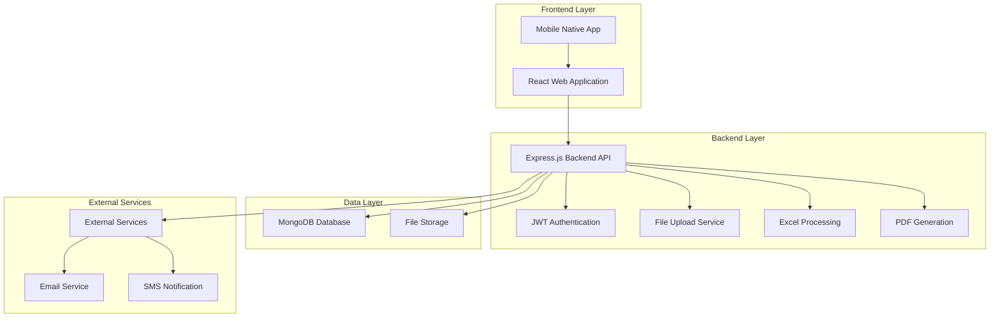
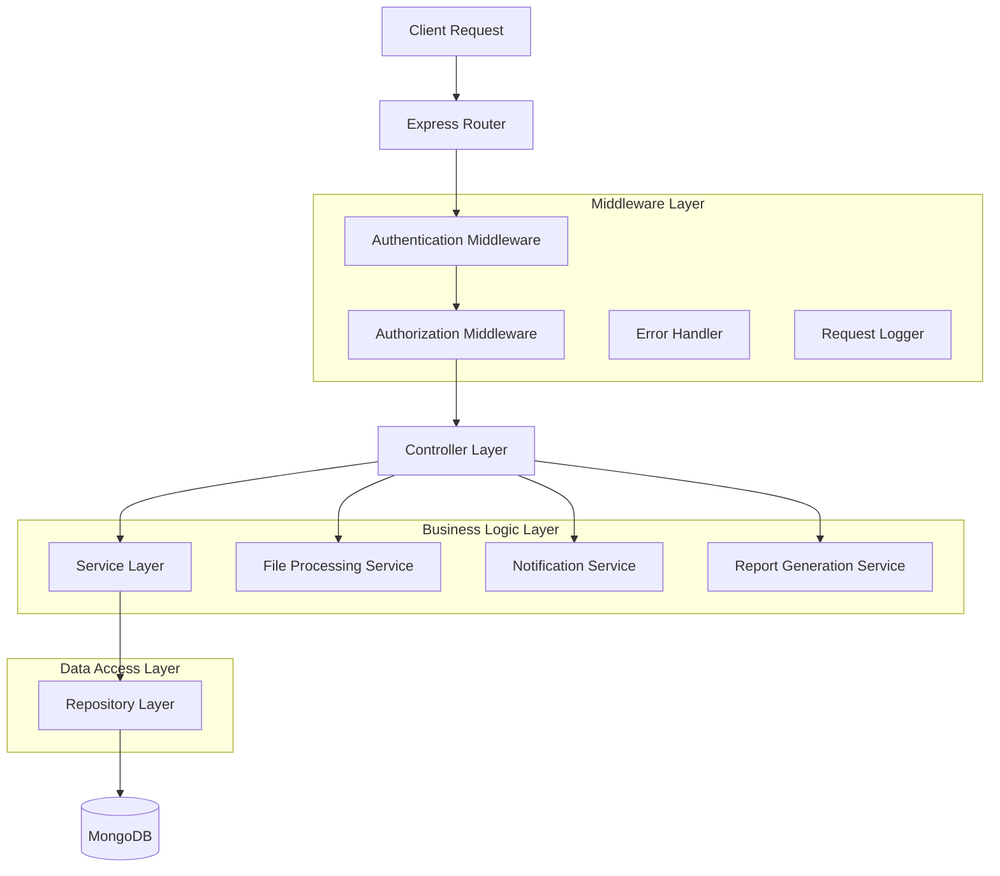
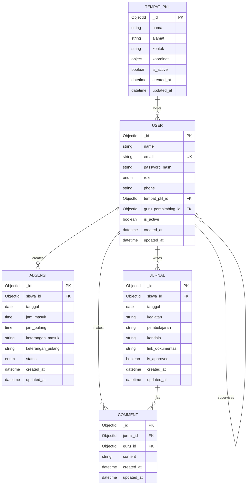

# Dokumen Arsitektur Teknis - Sistem Absensi dan Jurnal PKL

## 1. Architecture Design



## 2. Technology Description

* Frontend: React\@18 + TypeScript + Tailwind CSS + Vite

* Backend: Node.js + Express.js\@4 + TypeScript

* Database: MongoDB + Mongoose ODM

* Authentication: JWT + bcrypt

* File Processing: multer + xlsx + jsPDF

* Mobile: React Native (future integration)

## 3. Data Service

* MongoDB: Primary database untuk semua data aplikasi

* File Storage: Local storage untuk upload file Excel dan generated reports

* Redis: Session management dan caching (optional)

* Email Service: Nodemailer untuk notifikasi

## 4. API Definitions

### 4.1 Authentication API

**User Login**

```
POST /api/auth/login
```

Request:

| Param Name | Param Type | isRequired | Description              |
| ---------- | ---------- | ---------- | ------------------------ |
| email      | string     | true       | Email pengguna           |
| password   | string     | true       | Password pengguna        |
| role       | string     | true       | Role: admin, guru, siswa |

Response:

| Param Name | Param Type | Description          |
| ---------- | ---------- | -------------------- |
| success    | boolean    | Status response      |
| token      | string     | JWT access token     |
| user       | object     | Data user yang login |
| role       | string     | Role pengguna        |

**User Logout**

```
POST /api/auth/logout
```

### 4.2 User Management API

**Get All Users**

```
GET /api/users?role=guru&page=1&limit=10
```

**Create User**

```
POST /api/users
```

Request:

| Param Name           | Param Type | isRequired | Description                      |
| -------------------- | ---------- | ---------- | -------------------------------- |
| name                 | string     | true       | Nama lengkap                     |
| email                | string     | true       | Email unik                       |
| role                 | string     | true       | admin/guru/siswa                 |
| phone                | string     | false      | Nomor telepon                    |
| tempat\_pkl\_id      | string     | false      | ID tempat PKL (untuk siswa)      |
| guru\_pembimbing\_id | string     | false      | ID guru pembimbing (untuk siswa) |

**Import Users from Excel**

```
POST /api/users/import
```

### 4.3 Tempat PKL API

**Get All Tempat PKL**

```
GET /api/tempat-pkl
```

**Create Tempat PKL**

```
POST /api/tempat-pkl
```

Request:

| Param Name | Param Type | isRequired | Description                      |
| ---------- | ---------- | ---------- | -------------------------------- |
| nama       | string     | true       | Nama tempat PKL                  |
| alamat     | string     | true       | Alamat lengkap                   |
| kontak     | string     | false      | Kontak person                    |
| koordinat  | object     | false      | {lat, lng} untuk validasi lokasi |

### 4.4 Absensi API

**Check In/Out**

```
POST /api/absensi
```

Request:

| Param Name | Param Type | isRequired | Description             |
| ---------- | ---------- | ---------- | ----------------------- |
| type       | string     | true       | 'masuk' atau 'pulang'   |
| keterangan | string     | false      | Keterangan tambahan (optional) |

**Get Absensi History**

```
GET /api/absensi?siswa_id=xxx&start_date=2024-01-01&end_date=2024-01-31
```

### 4.5 Jurnal API

**Create Jurnal**

```
POST /api/jurnal
```

Request:

| Param Name        | Param Type | isRequired | Description                           |
| ----------------- | ---------- | ---------- | ------------------------------------- |
| tanggal           | date       | true       | Tanggal jurnal                        |
| kegiatan          | string     | true       | Deskripsi kegiatan                    |
| pembelajaran      | string     | false      | Pembelajaran yang didapat             |
| kendala           | string     | false      | Kendala yang dihadapi                 |
| link_dokumentasi  | string     | false      | Link Google Drive untuk foto kegiatan |

**Get Jurnal with Comments**

```
GET /api/jurnal?siswa_id=xxx&month=2024-01
```

**Add Comment to Jurnal**

```
POST /api/jurnal/:id/comment
```

### 4.6 Report API

**Generate Absensi Report**

```
GET /api/reports/absensi?format=excel&siswa_id=xxx&start_date=2024-01-01&end_date=2024-01-31
```

**Generate Jurnal Report**

```
GET /api/reports/jurnal?format=pdf&siswa_id=xxx&month=2024-01
```

## 5. Server Architecture Diagram



## 6. Data Model

### 6.1 Data Model Definition



### 6.2 Data Definition Language

**User Schema**

```javascript
const userSchema = new mongoose.Schema({
  name: { type: String, required: true },
  email: { type: String, required: true, unique: true },
  password_hash: { type: String, required: true },
  role: { type: String, enum: ['admin', 'guru', 'siswa'], required: true },
  phone: { type: String },
  tempat_pkl_id: { type: mongoose.Schema.Types.ObjectId, ref: 'TempatPKL' },
  guru_pembimbing_id: { type: mongoose.Schema.Types.ObjectId, ref: 'User' },
  is_active: { type: Boolean, default: true }
}, { timestamps: true });
```

**Tempat PKL Schema**

```javascript
const tempatPKLSchema = new mongoose.Schema({
  nama: { type: String, required: true },
  alamat: { type: String, required: true },
  kontak: { type: String },
  koordinat: {
    lat: { type: Number },
    lng: { type: Number }
  },
  is_active: { type: Boolean, default: true }
}, { timestamps: true });
```

**Absensi Schema**

```javascript
const absensiSchema = new mongoose.Schema({
  siswa_id: { type: mongoose.Schema.Types.ObjectId, ref: 'User', required: true },
  tanggal: { type: Date, required: true },
  jam_masuk: { type: Date },
  jam_pulang: { type: Date },
  keterangan_masuk: { type: String },
  keterangan_pulang: { type: String },
  status: { type: String, enum: ['hadir', 'terlambat', 'alpha'], default: 'hadir' }
}, { timestamps: true });
```

**Jurnal Schema**

```javascript
const jurnalSchema = new mongoose.Schema({
  siswa_id: { type: mongoose.Schema.Types.ObjectId, ref: 'User', required: true },
  tanggal: { type: Date, required: true },
  kegiatan: { type: String, required: true },
  pembelajaran: { type: String },
  kendala: { type: String },
  link_dokumentasi: { type: String },
  is_approved: { type: Boolean, default: false }
}, { timestamps: true });
```

**Comment Schema**

```javascript
const commentSchema = new mongoose.Schema({
  jurnal_id: { type: mongoose.Schema.Types.ObjectId, ref: 'Jurnal', required: true },
  guru_id: { type: mongoose.Schema.Types.ObjectId, ref: 'User', required: true },
  content: { type: String, required: true }
}, { timestamps: true });
```

**Indexes untuk Performance**

```javascript
// User indexes
userSchema.index({ email: 1 });
userSchema.index({ role: 1 });
userSchema.index({ guru_pembimbing_id: 1 });

// Absensi indexes
absensiSchema.index({ siswa_id: 1, tanggal: -1 });
absensiSchema.index({ tanggal: -1 });

// Jurnal indexes
jurnalSchema.index({ siswa_id: 1, tanggal: -1 });
jurnalSchema.index({ tanggal: -1 });

// Comment indexes
commentSchema.index({ jurnal_id: 1 });
commentSchema.index({ guru_id: 1 });
```

